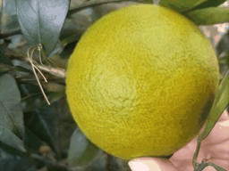

<br><br><br>

# DeepCCP
## Prerequisites
- Python 3
- NVIDIA GPU + CUDA CuDNN

## Getting Started
### Installation

- Clone this repo:
```bash
git clone https://https://github.com/BaoZehan/DeepCCP
cd DeepCCP
```

- Install [TensorFlow] and 2.4+ and other dependencies

### DeepCCP train/test

- Download the citrus peel color transition dataset(.npy). 
Check [here](https://pan.baidu.com/s/1upVP5VYWzpNycq6M25hHaA?pwd=tiou). 
Access Code：tiou 

- Train a model:
```bash
python train.py 
```

- Download the citrus peel color transition dataset(.jpg). 
Check [here](https://pan.baidu.com/s/1zcMxKr99TCR7NYcgUeQflg?pwd=17et). 
Access Code：17et 

- Test the model:
```bash
python pre_plot.py 
```

### Apply a pre-trained model 
- You can download a pretrained model [here](https://pan.baidu.com/s/1xCZOzUEnJLtzrD8efO1IRw?pwd=0za5).
Access Code：0za5 
